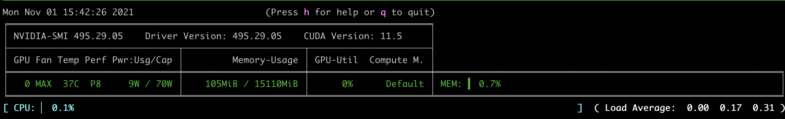

# blender-companion

## Installation
Install dependencies from the requirements file
`pip install -r requirements.txt`

Run setup build
`python setup.py develop`

## Run demo
Spin up search engine server
`./up_search_bing.sh`  

Run interactive demo
`./run_demo.sh`  

You may monitor the hardware usage i.e. CPU, Memory, Accelerators/GPU through `nvitop --monitor auto` or `nvidia-smi`  

